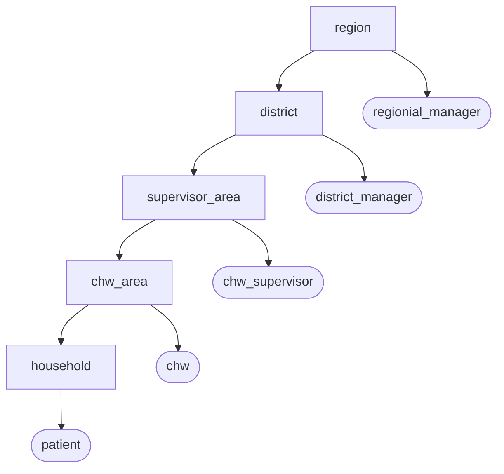

# Custom Hierarchy

Demonstrates various supervision workflows for users in a deep custom hierarchy.

```mermaid
graph TD
    region
    district
    supervisor_area
    chw_area
    household
    
    regional_manager([regionial_manager])
    district_manager([district_manager])
    chw_supervisor([chw_supervisor])
    chw([chw])
    patient([patient])
    
    region --> district & regional_manager
    district --> supervisor_area & district_manager
    supervisor_area --> chw_area & chw_supervisor
    chw_area --> household & chw
    household --> patient
```
